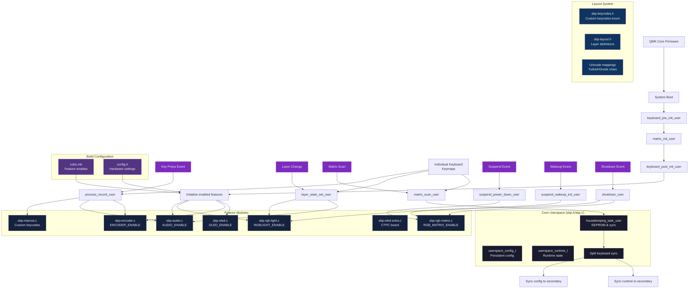

# SBP userspace code for qmk

My userspace code for my various keyboards; available here.

# TODO

- [ ] Make persistent base layer toggle code.
- [ ] Reorganize code-base and make sure things compile.
- [ ] Make sure the flake formalism is working.
- [ ] Re-introduce KG songs in audio.
- [ ] Make OLED mode switching keycode. 

# Change from QMK conventions

The `user` functions are split into `user` and `keymap` variants.
The `user` variants are defined in this directory (`users/<user>`).
The `keymap` variants are meant to be used from each specific keyboard directory.

This is a change from the main setup of [*QMK*](https://docs.qmk.fm/custom_quantum_functions#a-word-on-core-vs-keyboards-vs-keymap).
Therefore, defines on `*_user()` call weakly defined `*_keymap()`;
so that they can be overriden later in the code.

# Features

My userspace has a lot of shared code between different keyboards.
These files are prefixed with `sbp-` to remove any possible naming clashes.

* [sbp-audio](sbp-audio.c): Code dealing with audio playback using onboard sound.
* [sbp-encoder](sbp-encoder.c): Rotary encoder sutff.
* [sbp-macro](sbp-macro.c): My custom keycodes; macros, tap dances, etc.
* [sbp-oled](sbp-oled.c): Controls OLED displays. There is also [sbp-oled-extra](sbp-oled-extra.c) for boards with extra on-board memory.
* [sbp-rgb-matrix](sbp-rgb-matrix.c): Controls per-key RGB LED matrix stuff, and layer indication. Uses `RGB_MATRIX`.
* [sbp-rgb-light](sbp-rgb-light.c): Controls RGB LED strip, and layer indication. Uses `RGBLIGHT`.

## Builds

These are my keyboard builds and info, it allows me to plan out my builds. 

### Corne ARM

* Board: `crkbd/rev1`
* Microcontroller: Proton C (x2)
* Layout: `split_3x6_3`
* Functionality: OLED, Audio, Per-key RGB Lighting, Rotary Encoder (x2)
* Case: IMK Corne Case v2 Polycarbonate
* Switches: Healios V2
* Keycaps: POM Jelly

PCB is actually [Proton-C Compatible crkbd PCB](https://github.com/ItsWaffle/waffle_corne).

### Kyria

* Board: `splitkb/kyria/rev1`
* Microcontroller: Pro Micro (x2)
* Layout: `split_3x6_6`
* Functionality: OLED, Underglow RGB Lighting (No firmware space), Rotary Encoder (x2)
* Case: Matte Black Acrylic High-Profile case
* Switches: Gateron Ink Silent Black
* Keycaps: Oblotzky SA Oblivion

Main driver at work currently; love the switches and the board layout.

### Planck Light

* Board: `planck/light`
* Microcontroller: Embedded
* Layout: `ortho_4x12`
* Functionality: Per-key RGB Lighting, Audio.
* Case: Clear Acrylic Top and Bottow, with Frosted Acrylic Diffuser (Smashing Acrylics)
* Switches: BOX Navy
* Keycaps: Datamancer Tall Deco Typewriter Keycaps

Just a decorative planck replacement (for my rev4 PCB that died.)
This one is malfunctioning as well, maybe needs retiring.

### Planck SERVER

* Board: `kprepublic/jj40`
* Microcontroller: Embedded
* Layout: `ortho_4x12`
* Functionality: Underglow RGB Lighting, LED diode lighting.
* Case: Clear Acrylic Top and Bottow, with Frosted Acrylic Diffuser (Smashing Acrylics)
* Switches: BOX Navy
* Keycaps: Datamancer Tall Deco Typewriter Keycaps

Just a decorative planck replacement (for my rev4 PCB that died.)

### Corne Lite

* Board: `crkbd/rev1`
* Microcontroller: Pro Micro (x2)
* Layout: `split_3x5_3`
* Functionality: Per-key RGB Lighting, OLED (No firmware space)
* Case: Custom
* Switches: Choc Low Burnt Orange
* Keycaps: [Scooped Choc Keycaps](https://mkultra.click/collections/keycaps/products/scooped-choc-keycaps?variant=31223543365730)

Maybe try adding a trackpad for this, as detailed
[here](https://github.com/manna-harbour/crkbd/blob/master/trackpoint/readme.org).

# Firmware building

## Archlinux (OBSOLETE)

On archlinux, the package *arm-none-eabi-gcc* is too new.
To fix; add to the environment `CFLAGS="-Wno-error=deprecated"` to compilation commands.
Also; says to run `avr-gcc` version `8.4.0` for smaller firmware,
but I find that it only saves a few bytes.

## Bootloader

Needed to type this out from the QMK website.
If I want to flash a new bootloader for a machine; here are steps;

1. Flash the util/pro_micro_ISP_B6_10.hex to a spare promicro using;
`avrdude -p atmega32u4 -P "$(ls /dev/ttyACM*)" -c avr109 -D -U flash:w:pro_micro_ISP_B6_10.hex`
2. Wire the pins; (first is the ISP pro micro; second is the target)
```
Pro Micro 10 (B6)  <-> Keyboard RESET
Pro Micro 15 (B1)  <-> Keyboard B1 (SCLK)
Pro Micro 16 (B2)  <-> Keyboard B2 (MOSI)
Pro Micro 14 (B3)  <-> Keyboard B3 (MISO)
Pro Micro VCC      <-> Keyboard VCC
Pro Micro GND      <-> Keyboard GND
```
I do have this on hand I believe; from massdrop's planck light firmware updater.
3. Connect the flashed pro micro to my computer and run
`avrdude -c avrisp -P "$(ls /dev/ttyACM*)" -p atmega32u4 -U flash:w:bootloader_atmega32u4_1.0.0.hex:i -U lfuse:w:0x5E:m -U hfuse:w:0xD9:m -U efuse:w:0xC3:m`

The avrisp here refers to the firmware on the ISP flasher pro micro.
The `atmega32u4` refers to the CPU used in the respective breakout boards.
The `avrdude` command interacts with catalina bootloader.
The shell call after the `-P` flag auto finds the port that the pro micro connects to.
The last few arguments are some jumpers apparently.

# Code Architecture

The userspace code is organized in a modular way with conditional compilation for different features:



# Layout

My personal layout is mostly inspired by the
[Miryoku layout](../manna-harbour_miryoku/miryoku.org).
There are some changes to make it friendlier to international keyboards.
My board is compatible with software implementation of Dvorak and Turkish F.

## Base

Base layer uses tap-hold functionality to have access to modifiers.
The modifiers are mirrored on each half of the layout;
as to make those modifiers accessible to the keys that overlap them.
Besides the Alt key; each side has the proper L/R version of the modifier.
Since Right Alt key functions as AltGr key;
both the L and R versions are available on each side.
